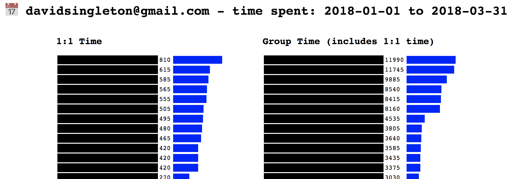

# gcal-cruncher
Crunches .ics files exported from Google calendar to show you where your time has been spent

# Howto
* Download a `.ics` export of your Google Calendar.
* Run the script
```ruby gcal-cruncher.rb --me your@email.com -s 2018/1/1 -e 2018/3/31 cal.ics```
* Get pretty output as `time.html`

# Example output
Note, you'll see email addresses, not the black boxes redacting my output

